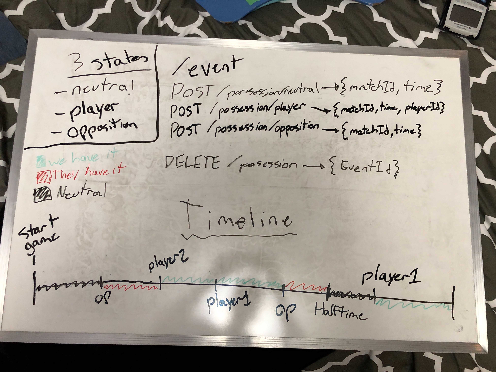

# Swagger Docs

In order to view the MWM Api documentation locally. Run

```bash
npm run start
```

Then navigate to [http://localhost:3001/api](http://localhost:3001/api)
**_Note:_** 3001 is the default port. Remember to use the port you have set in main.ts in the backend/src directory.

## Api Docs

Docs can be found <a href="./SwaggerUI.html" target="_blank">here</a>

The following demonstrates how db objects, api endpoints, and stats can be calculated/

### Ball Possession



Ball possession can be in 3 states during a game:

1. A player has the ball.
1. An opponent has the ball.
1. The ball is neutral.

There is a POST API endpoint that can be used to set the state of the ball. The ball is assumed to start in a neutral state at the beginning of the match AND at the beginning of the second half. When calculating stats this should be taken into account.

The timeline demonstrates how this would work.

The DELETE API endpoint does not delete the entity from the DB but instead sets an "archived" flag to true. This will allow for easier modification later.
