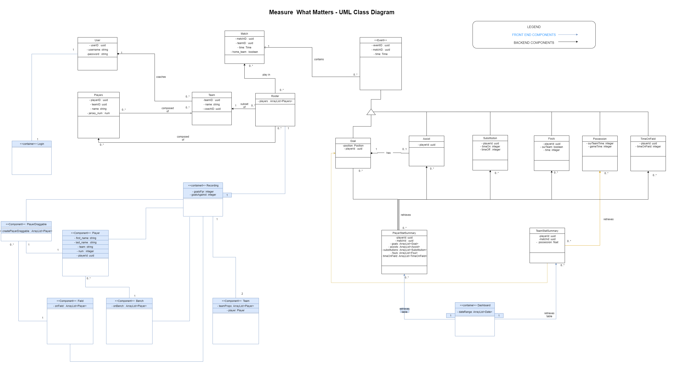
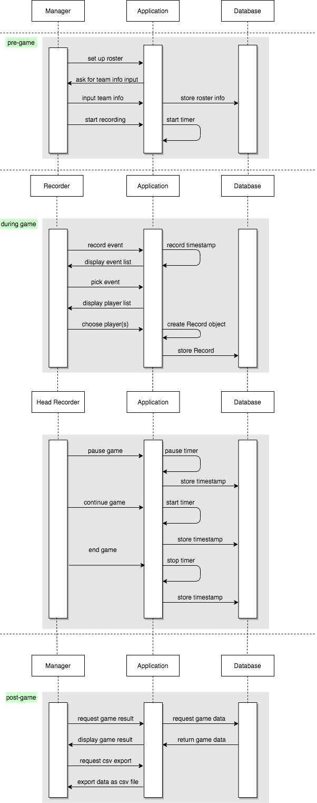

# Design
## UI/X Design
### Wireframes
[Go to wireframes page](wireframes)

## Software Design
This page includes a short description of the overall architecture style of the system, its high-level system components, and their logical (what data they exchange) and control (how they invoke each other) dependencies.

### Architecture/Component Diagram
In our component diagram we have three important views which are the viewer who is someone who just watches events as they come in, the parent who records the events and the coach who can manage the lineup. The viewer depends on the game and the events, the parent is dependent on all components in order to be able to record, and the coach is dependent on the roster and game to control the lineups. A roster also cannot exist without the required interface RosterMember. All components are secured by our infrastructure through the implementation of a login flow so they require the access control interface provided by the security component. All components are persisted by our infrastructure through the required interface TypeORM into the application database. 

### UML Class Diagram
A UML for the recording application Measure What Matters. This UML displays how the team managers will add recorders and set up a roster for matches. The recorders will record various event types that will be saved in both the players' profile and the team stats profile. These can later be retrieved by the Team Manager to better understand the analytics of how the team is performing.

### Sequence Diagram
The sequence diagram describes the flow of recording sports events. They are devided into three stages: pre game, during game, and post game.

