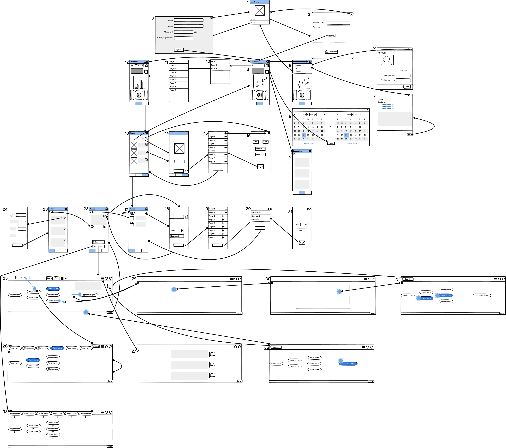

# Wireframes
## Sprint 1

View | Satisfies User Stories | Description
---- | -----------------------|------------
1 | / | Landing page.
2 | 1.1.1 | Sign up page.
3 | 1.1.2 | Log in page. Optional redirection to log in with external team app.
4 | 3.1.1, 3.2.1, 3.2.2, 3.2.3, 3.2.4, 3.2.5, 3.2.6, & 3.2.7 | Team dashboard. Can click single user icon to begin navigating to individual player dashboard. Contains numerous reports from the statistics of the latest selected team. Reports can be a combination of text and graphical outputs. Reports apply to the team as a whole rather than individual players here.
5 | 1.1.3 | Options menu. Among other possibilities, will allow logging out and navigating to account and help sub-menus.
6 | 1.1.4 & 1.1.5 | Account information page. Contains text fields to display un-editable account info and input fields to begin editing previously entered account info.
7 | / | Help page. Offers a walkthrough to onboard new users.
8 | 3.2.10 | Time range selection component. Allows entering a range with which dashboard should use data to generate reports from.
9 | 3.2.8 | Suggestions page. Includes a number of text fields with advice to the coach based on generated statistics.
10 | / | Teams list. Allows selecting one of the users registered teams.
11 | / | Players list. Allows selecting a player from the previously specified teams roster.
12 | 3.2.12 | Player dashboard. Can click the group of users icon to return to the team dashboard. Same reporting functionality as described in view 4 but specific to the selected user rather than to a team.
13 | 1.2.1 & 1.2.2 | Teams page. Can add teams by click the add icon. Can link teams from other team management apps by click the link icon. Can click on a team to navigate to that teams dashboard.
14 | / | Adding team info page. Includes a image upload for the team logo. Includes input field for team name. Could have fields for other inputs. Includes a button to navigate to the next step of team creation. 
15 | / | Team roster page. Can add players by clicking the add icon. Can remove previously added players from the roster by clicking an associated minus icon. Button to submit and finalize the team.
16 | / | Invite page. Can enter fields containing information for the player to be invited. One field to enter the email where the invite should be sent. A submit button to send the invite.
17 | / | Games page. Displays the date/time and a text field of info for previously added games. Can toggle between upcoming and historical games. Can click the add icon to add a game.
18 | / | Adding game info page. Includes a field for the date/time. Includes a drop down to select which of the users teams this game is for. Includes text fields to add relevant details. Includes a button to navigate to the next step of game creation. 
19 | 1.2.3 | Game lineup page. Uses the team roster to populate a list of players and each player can be added or removed from the game lineup. Includes a button to navigate to the next step of game creation.
20 | / | Recorder page. Lists the recorders who have been invited to record for this game. Can add recorders by clicking the add button. Button to submit and finalize the game creation.
21 | 1.3.1 | Reuses the invite page from view 16 but removes the position drop down. Emails sent from this flow send an invite to be a recorder.
22 | 1.4.1 & 3.2.9 | Game details page. Includes text fields to display previously entered game info. Includes an export and history button if the game has already happened. Includes an edit button, a role selection drop down menu, and a go to recording interface button, if the game has yet to happen. 
23 | 2.2.1 | Event history list. Depending on the users role, will display their own recorded events (recorder) or the list of all recorded events (coaching staff) for the given game. For each event includes an edit button.
24 | 3.2.11 | Event details page. Depending on the event selected previously, this page will contain a set of (guided) input fields to edit the events details. Can be used to correct errors.
25 | 1.4.2, 2.1.9, 2.1.10, 2.1.11, & 2.1.13 | The default recording screen. Depending on the users role some u/i may be absent; only those elements related to their recording role will be present. Represents the soccer field, including in bounds and out of bounds regions. Out of bounds region contains a bench zone. Score and time are displayed in text fields. Includes button to start and stop game time. Includes a text field displaying help / feedback for entered events.  Includes a button to enter the infractions menu. Contains a number of draggable bubbles representing our team's players and a bubble representing the opposing team. A history, undo, and redo icons are present. Clicking a player bubble (or the opposing team bubble) without dragging will indicate the player (or the opposing team) has possession of the ball.
26 | 2.1.1 | Substitution screen. Once a player bubble has been dragged into the bench zone, this screen is displayed. The bench zone expands to show the players from the game lineup that are not on the field currently. Selecting a player on the field and then one on the bench will substitute those players. This process can be repeated. Substitutions are finalized by clicking the submit button.
27 | 2.1.12 & 2.1.14 | Event history list. Similar to functionality provided by view 23 but omits editing buttons. Each text field has a flag button to indicate an issue with the event.
28 | 2.1.4, 2.1.7, & 2.1.8 | Players screen. Includes the player bubbles. If this screen is entered from the infractions icon, a player can be selected followed by selecting a penalty from a list of text fields (not shown). If this screen is entered by a click in the out of bounds region, a player can be selected to indicate who took the throw in or kick followed by a selection of whether it was a throw in or a kick in (not shown). The submit button confirms the entry.
29 | 2.1.3 | Event location screen. Represents the game field. Selecting an area will relate an event with a location on the field.
30 | 2.1.2 & 2.1.5 | Net location screen. Represents a teams net. Selecting an area will relate a shot with a particular position of the net and then a list of outcome text fields will be displayed for selection (not shown).
31 | 2.1.6 | Players screen (repeat). See view 28 for general layout. When entered from the goal screen, allows selecting team mates who assisted the goal.
32 | 2.3.1 | Player time on/off field. Displays bubbles for players on and off the bench. Each player has a integer field which displays their time on or off of the field as appropriate.

## Sprint 2
To be updated as required.