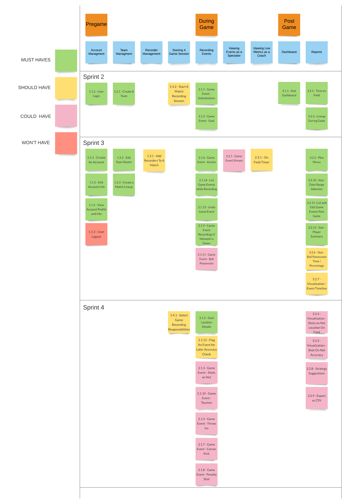

# Project Management
This page provides a general overview of the assigned tasks and roles for the duration of four sprints (subject to change).

## Story Map

## Roles

Here are the general rules for assigning tasks on the team:

### Front-end Programmer

* Chloe Shang 
* Taylor Zowtuk 

### Back-end Programmer

* Bardia Samimi
* Joseph Potentier

### DevOp

* Ayub Ahmed

### Product Manager

* Bardia Samimi

### Floater*

* Ayub Ahmed
* Joseph Potentier

*Floater will be allocated to the various roles as required by the demands of a sprint.

**These roles are subject to change throughout the semester as needed - will update if this changes.

## Project Plan
### Sprint 1  
**Due: September 27**

| **Task To-Do** | **Assigned To** | **Date To Complete By** |
| --- | --- | --- | 
| During game user stories, component diagram | Ayub | September 27 |  
| Pregame user stories, class diagram | Bard | September 27 |
| Sequence diagram, class diagram | Chloe | September 27 |  
| Postgame user stories, project plan | Joe | September 27 |
| Set up docs, project overview, similar/open-source projects, technical resources, glossary, wireframe, team roles | Taylor | September 27 |

### Sprint 2  
**Due: October 18**

| **Task To-Do** | **Assigned To** | **Date To Complete By** |
| --- | --- | --- | 
| Back-end for create a team, back-end for events, front-end for dashboard | Ayub | October 18 |  
| Back-end for start recording, back-end for reports | Bard | October 18 |
| Front-end for login and create a team, front-end for line up during goal report | Chloe | October 18 |  
| Back-end for create a team, back-end stat dashboard | Joe | October 18 |
| Front-end for start recording and goal and substitution events, front end for time on field report | Taylor | October 18 |

