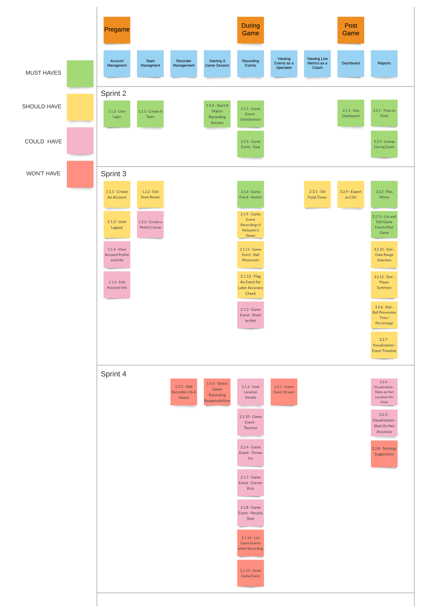

# Project Management
This page provides a general overview of the assigned tasks and roles for the duration of four sprints (subject to change).

## Story Map

## Roles

Here are the general rules for assigning tasks on the team:

### Front-end Programmer

* Chloe Shang 
* Taylor Zowtuk 

### Back-end Programmer

* Bardia Samimi
* Joseph Potentier

### DevOp

* Ayub Ahmed

### Product Manager

* Bardia Samimi

### Floater*

* Ayub Ahmed
* Joseph Potentier

*Floater will be allocated to the various roles as required by the demands of a sprint.

**These roles are subject to change throughout the semester as needed - will update if this changes.

## Project Plan
### Sprint 1  
**Due: September 27**

| **Task To-Do** | **Assigned To** | **Date To Complete By** |
| --- | --- | --- | 
| Set up docs | Taylor | September 22 |
| Sequence diagram | Chloe | September 22 |
| During game user stories | Ayub | September 23 |
| Postgame user stories | Joe | September 23 |
| Pregame user stories | Bard | September 23 |
| Project overview, similar/open-source projects, technical resources, glossary, team roles | Taylor | September 24 |
| Component diagram | Ayub | September 25 |    
| Class diagram | Bard | September 26 |
| Class diagram | Chloe | September 26 | 
| Project plan | Joe | September 26 |
| Wireframe | Taylor | September 27 |

### Sprint 2  
**Due: October 18**

| **Task To-Do** | **Assigned To** | **Date To Complete By** |
| --- | --- | --- | 
| Bootstrap back and front-end | Ayub | October 1 |
| Back-end for create a login | Joe | October 4 |
| Back-end stat dashboard | Joe | October 8 |
| Back-end for start recording, back-end for reports | Bard | October 12 |
| Back-end for create a team, back-end for events | Ayub | October 14 |  
| Front-end for login | Chloe | October 14 |  
| Front-end for start recording & goal and substitution events | Taylor | October 14 |
| Front-end for dashboard | Ayub | October 16 | 
| Create a team & front-end for line up during goal report | Chloe | October 16 | 
| Back-end for reports | Bard | October 17 |
| Front end for time on field report | Taylor | October 17 |

### Sprint 3  
**Due: Continued from Sprint 2**

| **Task To-Do** | **Assigned To** | **Date To Complete By** |
| --- | --- | --- | 
| Player endpoint testing & goal and time on field stats testing & error handling sprint 2 user stories | Bard | October 20 |
| Finish connecting to BE for substitutions & test Bench, Player & error handling requests | Taylor | October 20 |
| Connect user login, team creation, and lineup during goals report to the BE | Chloe | October 21 |
| User login connecting FE to BE & token storage | Joe | October 21 |
| Unit test for match, goal, and substitution controller | Ayub | October 21 |
| Start recording & time on field stat user stories | Taylor | October 22 |
| Testing auth and users modules | Joe | October 22 |
| Error handling for match, goal, and substitution controller | Ayub | October 22 |

**Due: November 15**

| **Task To-Do** | **Assigned To** | **Date To Complete By** |
| --- | --- | --- | 
| View account profile and info BE | Joe | October 23 |
| Edit account info BE | Joe | October 23 |
| Create game event assists BE | Bard | October 22 |
| Export CSV FE | Ayub | October 21 |
| Export CSV BE | Joe | October 23 |
| Create game event assists FE | Taylor | October 23 |
| Create a match lineup FE | Ayub | October 25 |
| Create a match lineup BE | Bard | October 25 |
| Logout FE | Ayub | October 31 |
| Create an account FE | Chloe | November 1 |
| Game event ball possession FE | Taylor | November 1 |
| Game event ball possession BE | Joe | November 1 |
| Timer (start + stop) FE | Chloe | November 1 |
| Ball possession FE | Ayub | November 1 |
| Ball possession BE | Bard | November 1 |
| Flag event BE | Joe | November 2 |
| Edit team roster FE | Ayub | November 3 |
| Edit team roster BE | Bard | November 3 |
| Flag event FE | Ayub | November 5 |
| Game event shots on net BE | Bard | November 6 |
| View account profile and info FE | Chloe | November 6 |
| Game event shots on net FE | Taylor | November 7 |
| +/- BE | Bard | November 8 |
| Edit account info FE | Chloe | November 10 |
| List game events BE | Joe | November 11 |
| +/- FE | Taylor | November 12 |
| List game events FE | Chloe | November 12 |
| Date range selector FE | Ayub | November 12 |
| Timeline FE | Taylor | November 13 |
| Timeline BE | Joe | November 13 |
| Cache events | Taylor | November 13 |
| Player summary BE | Joe | November 14 |
| Player summary FE | Chloe | November 14 |

**Due: November 26 8pm**

| **Task To-Do** | **Assigned To** | **Date To Complete By** |
| --- | --- | --- | 

| User Manual | Chloe | November 18 |
| Migrations BE | Joe | November 19 |
| Deployment Documentation | Ayub/ Joe | November 19 |
| Deploying App Cybera | Ayub/ Joe | November 19 |
| Stats by Match | Ayub | November 20 |
| Testing that App works on Cell | Ayub @ deployment/ Everyone should try | November 21 |
| Manifest | Taylor / Bard | November 21 |
| Match Timer FE | Taylor | November 22 |
| Caching Events + Offline FE | Ayub | November 23 |
| Player Summary FE | Chloe | November 25 |
| Player Summary BE | Bard | November 25 |
| Styling | TEAM EFFORT | November 26 |
